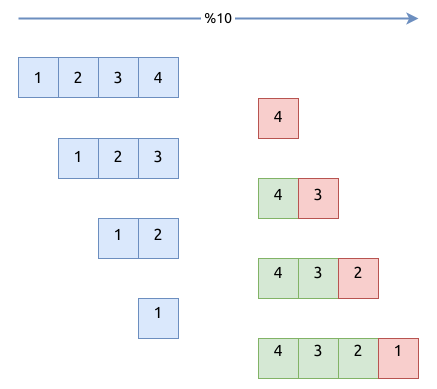
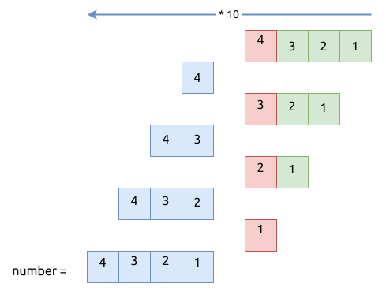
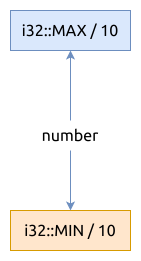

# 0007. 整数反转 Reverse Integer

[问题描述](https://leetcode.com/problems/reverse-integer)

这是一个数学问题. 它考察的知识有这几个方面:

1. 如何从十进制的整数中提取出各个位的值
2. 如何从各个位的值重新组装一个整数
3. 如何处理整数边界溢出的问题

接下来我们分别来说说.

## 从十进制的整数中提取出各个位的值

要使用 `除10` 的操作, 进行十进制的右移.

```rust
let mut x = 1234;
while x != 0 {
  println!("unit value: {}", x % 10);
  x /= 10;
} 
```

看图:



## 重新组装整数

如何从各个位的值重新组装一个整数? 使用相反的操作, `乘10`, 进行十进制的左移操作.

```rust
let mut number = 0;
let bits = &[4, 3, 2, 1];
for bit in bits {
  number = number * 10 + bit;
}
println!("number: {number}");
```

看图:



## 整数溢出

如何处理整数边界溢出的问题? 在组装新的整数时, 可以让当前的值 `*10` 后与 `i32::MAX .. i32::MIN` 进行比较, 看在不在这个范围内.

```rust, ignore
number > i32::MAX / 10 || number < i32::MIN / 10
```



要注意的一点是, 不能使用 `number * 10 > i32::MAX` 这样的写法, 因为 `number * 10` 本身就可能溢出了!

基于以上3点, 编写出最终的代码:

```rust
{{#include src/main.rs:5:21 }}
```