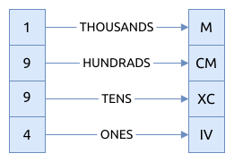

# 0012. 整数转罗马数字 Integer to Roman

[问题描述](https://leetcode.com/problems/integer-to-roman)

这也是字典映射问题, 目前实现了三种解法

## 模式匹配

这个类似于哈稀表, 但是性能更高.

```rust
{{#include src/main.rs:5:70 }}
```

## 分段映射

单独对每个进位做映射, 很简单的实现, 易懂.



```rust
{{#include src/main.rs:166:181 }}
```

## 手动匹配

这种方法支持更复杂的整数, 扩展性更好, 但是比较复杂, 性能也一般

```rust
{{#include src/main.rs:72:164 }}
```

## 相关问题

- [0013. 罗马数字转整数 Roman to Integer](../0013.roman-to-integer/index.md)
