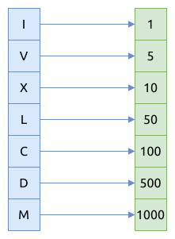

# 0013. 罗马数字转整数 Roman to Integer

[问题描述](https://leetcode.com/problems/roman-to-integer)

这是一个符号到整数的映射问题.

处理映射问题, 通常使用哈稀表, 如果元素比较少的话, 也可以使用 Rust 特有的模式匹配, 可以提高运行速度, 减少堆内存占用.

## 哈稀表

```rust
{{#include src/main.rs:7:47 }}
```

## 模式匹配



```rust
{{#include src/main.rs:52:66 }}
```

完整的代码如下:

```rust
{{#include src/main.rs:49:92 }}
```