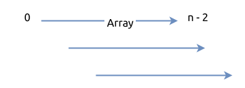
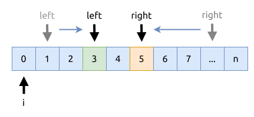

# 0015. 三数之和 3Sum

[问题描述](https://leetcode.com/problems/3sum)

## 暴力法

直接用多层遍历的方法, 暴力解决问题. 但这个方法的时间复杂度为 `O(n^3)`, 性能也是最差的.



```rust
{{#include src/main.rs:8:31 }}
```

## 靠拢型双指针

相关的方法介绍可以看[这里](../../two-pointers/close-up.md).

- 先对数组进行排序
- 外层循环遍历整个数组, 然后在内层使靠拢型用双指针, 来快速找到元素组合
- 可以跳过重复的元素

该算法的时间复杂度是 `O(n^2)`, 空间复杂度是 `O(n)`.



### Rust

```rust
{{#include src/main.rs:33:89}}
```

### C++

```cpp
{{#include main.cpp:5:64}}
```

## 哈稀表

这个方法的性能并不好, 但也算是解决问题的一个思路. 具体做法就是:

1. 使用两个字典分别存储大于0, 以及小于0的元素; 同时统计0出现的次数
2. 首先如果0存在, 尝试用它作为正负数的分隔, 其组合情况如下:
    - `(负数, 0, 正数)`
    - `(0, 0, 0)`
3. 现在考虑非0组合, 可能的组合情况如下:
    - `(负数, 负数, 正数)`
    - `(负数, 正数, 正数)`
4. 将所有的组合都添加到一个集合中, 这样就可以用它来去掉重复的组合

这种思路, 也同样可以用于解决 `target != 0` 的情况.

```rust
{{#include src/main.rs:143:219 }}
```
