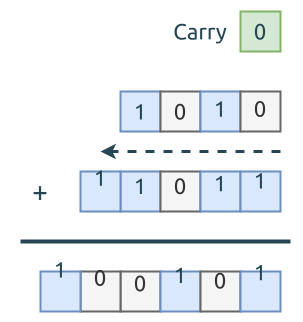

# 0067. 二进制求和 Add Binary

[问题描述](https://leetcode.com/problems/add-binary)

这个问题考察两个方面的知识:

- 逆序遍历字符串, 并从中解出每个字符. 这个很适合用迭代器
- 基本的加法操作, 要注意进位项 (carry), 每个比特位相加时, 都要加上进位项

下图展示的是 `a = "1010"; b = "11011"` 相加的过程:



代码写得就比较自然了, 就按上图描述的:

先构造出两个字符串的迭代器, 用于逆序遍历字符串, 这里为了方面, 我们直接用 `a.as_bytes().iter().rev()`,
它返回的类型是 `Iter<Rev<u8>>`.

```rust
{{#include src/main.rs:5:41 }}
```