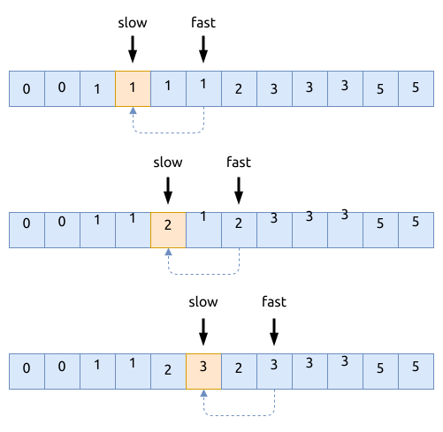
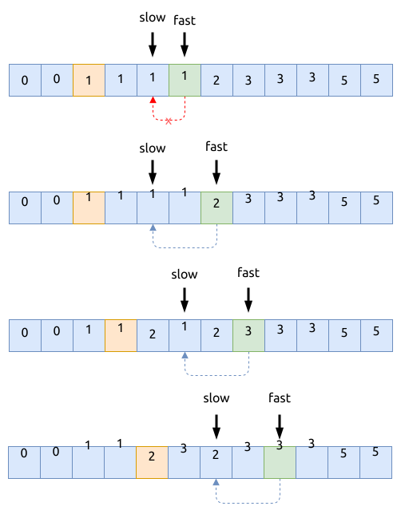

# 0080. 删除排序数组中的重复项 II Remove Duplicates from Sorted Array II

[问题描述](https://leetcode.com/problems/remove-duplicates-from-sorted-array-ii)

先分析这个题的条件:

- 数组是有序的, 有重复元素
- 原地移除部分重复元素, 每个重复的数值最多只能出现两次
- 要保持原先的顺序
- 空间复杂度是 `O(1)`

## 快慢型双指针

典型的[快慢型双指针](../../two-pointers/fast-slow.md)问题.

其中, 快指针用于遍历数组; 慢指针用于移除重复元素后, 指向数组的最高位.



```rust
{{#include src/main.rs:7:36 }}
```

## 优先双指针

这里的优化仅仅是简化了思路, 但是性能并不一定更好.



```rust
{{#include src/main.rs:38:61 }}
```

## 相关问题

- [0026. 删除有序数组中的重复项 Remove Duplicates from Sorted Array](../0026.remove-duplicates-from-sorted-array/index.md)