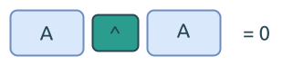

# 0136. Single Number

[问题描述](https://leetcode.com/problems/single-number)

这个问题考察的是比特位异或操作中的一个重要特性: `A XOR A == 0`.

我们可以利用这个特性, 遍历数组中的每一项, 然后计算异或值, 最后的结果就是那个单值.



这个思路, 可以用于快速消除数组中出现偶数次的元素.

代码也非常简单:

```rust
{{#include src/main.rs:5:12 }}
```