# 0137. Single Number II

[问题描述](https://leetcode.com/problems/single-number-ii)

## 第一种思路, 使用字典来计数

很直接的想法, 用字典来统计所有数值出现的次数, 然后遍历该字典, 找到次数为1的那个数值.

```rust
{{#include src/main.rs:5:20 }}
```

## 第二种思路, 使用 BitVector

这个题目, 因为是奇数次重复的数, 所以不能再使用 [0136. Single Number](../0136.single-number/index.md) 里面的方法.

这个需要一个新的思路, 那就是 BitVector.

- 遍历数组中的每个整数的每一个比特位
- 对所有整数的同一个比特位求和, 然后对3取余, 因为大部分整数都出现了3次; 求得的余数, 就是落单的数值在该比特位的比特值
- 当遍历完整数的所有比特位后, 就可以计算出落单整数的所有比特位的信息, 也就可以组装出了它的具体数值

基本的操作过程如下图所示:



要注意的是, 这个解决方法, 可以解决数组中有奇数个重复的整数, 也可以解决有偶数个重复的整数.
也就是说, 它可以用来解 [0136. Single Number](../0136.single-number/index.md).

具体的代码如下:

```rust
{{#include src/main.rs:22:36 }}
```

## 第三种思路

TODO(Shaohua): Use `ones` and `twos` to record.