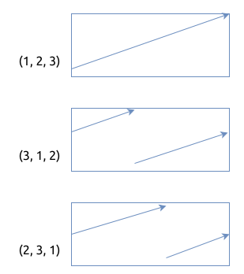

# 寻找旋转排序数组中的最小值 Find Minimum in Rotated Sorted Array

[问题描述](https://leetcode.com/problems/find-minimum-in-rotated-sorted-array)

这个是二分查找法的变体.

先分析题目中的条件:

1. 数组中没有重复的元素
2. 数组最初是升序排序的
3. 数组中的元素被右移了 `k` 次

基于以上条件, 我们可以推出, 数组中元素可能的布局只有三种情况:

- `(1, 2, 3)`
- `(3, 1, 2)`
- `(2, 3, 1)`

以上的布局决定了二分查找法中的 `middle` 元素所在的趋势. 大概如下图所示:



有了这样的分析, 就可以编写二分查找算法了:

```rust
{{#include src/main.rs:5:37}}
```