# 0162. 寻找峰值 Find Peak Element

[问题描述](https://leetcode.com/problems/find-peak-element)

这个题目中的数组并不是有序的, 所以可以先考虑暴力法.

## Brute force

遍历整个数组, 找到比左侧和右侧都大的那个元素.

但首先要检查边界情况, 即第一个元素和最后一个元素.

```rust
{{#include src/main.rs:5:29}}
```

该算法的时间复杂度是 `O(n)`.

## 二分查找法

这个表面上看, 并不能直接使用二分查找法.
但是, 这个题目只要求找到极大值, 并没有要求找到数组中的最大值, 所以仍然可以用二分查找法找出
比左侧和右侧都大的元素.

二分法中的 `middle` 元素与可能的极大值的关系有三种:

- `middle` 处就是峰值
- `middle` 位于峰值的左侧
- `middle` 位于峰值的右侧



我们编写二分查找法时, 就可以根据这些情况来处理:

```rust
{{#include src/main.rs:31:69}}
```

该算法的时间复杂度是 `O(log(n))`.