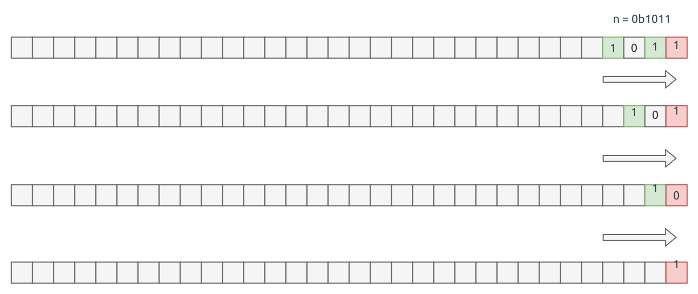

# 0191. Number of 1 Bits

[问题描述](https://leetcode.com/problems/number-of-1-bits)

这个题目考察位操作的.

先考虑比特位操作的函数表:

| A | B | A OR B | A AND B | A XOR B | NOT A |
|---|---|--------|---------|---------|-------|
| 1 | 1 | 1      | 1       | 0       | 0     |
| 1 | 0 | 1      | 0       | 1       | 0     |
| 0 | 1 | 1      | 0       | 1       | 1     |
| 0 | 0 | 0      | 0       | 0       | 1     |

其次是如何遍历 u32 的所有比特位? 是的, 用右移 (shift right), 依次将每一个比特位右移到最低位,
然后结合上面的逻辑与操作(bitwise `AND`), 就可以取出这个比特位的值, 是 0 或者 1.

下图展示的是 n=11 (即 `0b1011`) 时的右移操作:



想明白了上面的过程, 代码就比较容易了.

```rust
{{#include src/main.rs:25:31 }}
```

或者使用函数式风格的写法:

```rust
{{#include src/main.rs:33:35 }}
```