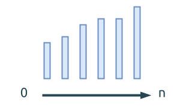
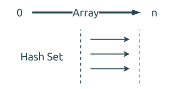

# 0217. 存在重复元素 Contains Duplicate

[问题描述](https://leetcode.com/problems/contains-duplicate)

## 方法1, Brute Force

直接暴力遍历 vector, 查找当前元素是否在后面出现过.


这个方法的时间复杂度为 `O(n^2)`. 可想而知, 这个解法是无法通过 leetcode 平台检验的, 结果会超时.
这个方法可以用来查找具体哪些元素是重复的.

```rust
{{#include src/main.rs:7:19 }}
```

## 方法2, 先排序, 再遍历

既然暴力遍历比较慢, 那能不能加快一些?
如果我们先给 vector 做排序, 然后应该只需要遍历它一次, 每个元素与相邻的元素比较是否相等, 就可以判定
是否包含重复的元素.



这个方法的时间复杂度为 `O(nlogn)`, 它还可以用来查找具体哪些元素是重复的.

```rust
{{#include src/main.rs:21:34 }}
```

## 方法3, 使用 HashSet 缓存数值

考虑到集合 (HashSet) 快速能查找元素的特性(时间是`O(1)`), 我们可以用它来存储元素, 加快查找.

先遍历整个数组, 查找集合中是否存在该元素, 如果存在就返回, 如果不存在就把它插入到集合中.



这个方法的时间复杂度为 `O(nlogn)`, 空间复杂度为 `O(n)`, 它还可以用来查找具体哪些元素是重复的.

```rust
{{#include src/main.rs:36:49 }}
```

## 方法4, 使用 HashSet 缓存所有数值

上面的`方法3`已经足够好了. 但是, 我们仔细考虑题目, 发现它并不要求我们找到究竟是哪些元素是重复的.

基于此, 我们可以对方法3做一下修改:

- 遍历整个数组, 将里面的所有元素都插入到集合中
- 比较集合中元素的个数是否与数组中元素的个数相同, 如果不同, 那就说明有重复元素


这个方法是利用了 HashSet 不存储重复元素的特性. 它的时间复杂度也是 `O(nlogn)`.
要注意的是, 这个方法并不一定比方法3更快, 这个得看数组中是否有重复元素, 以及重复元素所在位置.

```rust
{{#include src/main.rs:51:55 }}
```