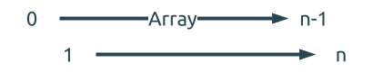
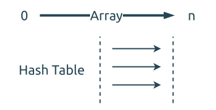

# 0219. 存在重复元素II Contains Duplicate II

[问题描述](https://leetcode.com/problems/contains-duplicate-ii)

这个问题与 [0001. 两数之和 Two Sum](../0001.two-sum/index.md) 很相似,
而且其解法也都是一样的.

## 方法1, Brute Force

这个方法比较直接, 就是遍历数组, 并遍历后面的每个元素, 判断它们是否重复.



因为有两层遍历, 这个方法的时间复杂度是 `O(n^2)`.

```rust
{{#include src/main.rs:7:20 }}
```

## 方法2, 哈稀表

同样是需要遍历整个数组, 我们可以使用哈稀表缓存一下访问过的元素, 以加快查找元素的时间.
这个哈稀表用于记录元素值到它在数组中的索引值之间的关系.



这个方法的时间复杂度是 `O(nlogn)`.

```rust
{{#include src/main.rs:22:40 }}
```