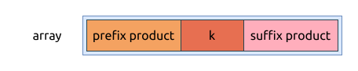

# 除自身以外数组的乘积 Product of Array Except Self

[问题描述](https://leetcode.com/problems/product-of-array-except-self)

## Brute force

这个方法会超时, 但是能帮助我们理解问题.

解决方法也很直接:

- 初始化目标数组, 其中每个元素都是 1
- 遍历目标数组, 并计算在当前位置的最终乘积, 通过依次遍历原数组

代码实现如下:

```rust
{{#include src/main.rs:5:21}}
```

该算法的时间复杂度是 `O(n^2)`, 空间复杂度是 `O(1)`.

## 使用除法

题目中禁止使用除法, 但并不妨碍我们尝试一下.

这个算法的步骤是:

- 遍历数组, 计算所有元的积, 并计算其中为0的元数个数
    - 如果当前元素的值为0, 将0的计数加1
    - 如果当前元素的值不为0, 就把它更新到所有元素的积
- 再次遍历原数组, 判断当前元素的值, 来计算当前索引位置的结果
    - 如果为0, 整个数组中0的个数为1, 说明其它元素都不为0, 该位置的值是 `整个数组的积 / 当前元素的值`
    - 如果为0, 则该位置的值是0
    - 如果不为0, 并且整个数组中0的个数不为0, 则该位置的值是0
    - 其它情况, 该位置的值是 `整个数组的积 / 当前元素的值`

该算法的实现如下:

```rust
{{#include src/main.rs:23:47}}
```

这种算法的特点:

- 时间复杂度是 `O(n)`
- 空间复杂度是 `O(1)`
- 除法的性能要差一些
- 需要更全面的考虑当前元素是否为0, 以及原数组中0的个数, 这个逻辑有些复杂
- 它可以重用原数组来存储返回结果

## 前缀和 Prefix sum

这个类似于计算数组的前缀和数组 (prefix sum array), 我称之为使用前缀积, 本选购就是以空间换时间.
通过将中间结果存储下来, 来减少每个元素位置使用的计算次数.

这种算法的步骤如下:

- 初始化结果数组, 数组中每个元素的值都为1
- 从左到右遍历原数组, 并累积计算元素的乘积, 将乘积保存到目标数组中的相同位置
- 从右到左遍历原数组, 并累积计算元素的乘积, 目标数组中的相同位置的元素与该乘积结果相乘, 就是该元素的最终值



代码实现如下:

```rust
{{#include src/main.rs:49:70}}
```

该算法的特点是:

- 时间复杂度是 `O(n)`
- 空间复杂度是 `O(1)`
- 没有使用除法
