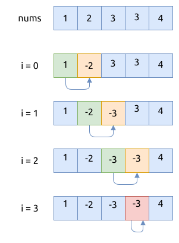

# 0287. 寻找重复数 Find the Duplicate Number

[问题描述](https://leetcode.com/problems/find-the-duplicate-number)

## 统计字典

- 创建一个字典, 用于统计每个整数出现的次数
- 遍历数组, 并更新字典
- 遍历字典, 找出出现次数大于1的整数, 这个就是重复的数
- 如果没有重复的整数, 就返回 -1

```rust
use std::collections::HashMap;

{{#include src/main.rs:7:29}}
```

这个方法的时间复杂度是 `O(n)`, 空间复杂度是 `O(n)`.

## 集合

这个方法是对上述方法的优化:

- 创建一个集合, 用于记录整数值是否出现过
- 遍历数组, 并将它存入到集合中, 如果此时集合中已经存在同样的整数, 这个整数就是重复的
- 否则返回 -1

```rust
use std::collections::HashSet;

{{#include src/main.rs:31:43}}
```

这个方法的时间复杂度是 `O(n)`, 空间复杂度是 `O(n)`.

## BitSet

使用 bitset 来存储整数值是否出现过.

```rust
{{#include src/main.rs:45:59}}
```

这个方法的时间复杂度是 `O(n)`, 空间复杂度是 `O(n)`.

这个方法比较浪费空间, 因为每个索引位置占了一个字节.
我们可以改进一下它, 实现一个节省空间的 bitset, 每个索引位置只占一个比特:

```rust
{{#include src/main.rs:61:82}}
```

上述几个方法的思路都类似, 只是用于存放整数索引的方式不同.

## 暴力法 Brute force

1. 先对数组进行排序 (这里已经不符合题目要求了)
2. 然后遍历数组, 找到左右相邻元素之间有重复的

```rust
{{#include src/main.rs:128:143}}
```

因为使用了排序算法, 这个方法比较慢, 时间复杂度是 `O(n log(n))`, 空间复杂度是 `O(1)`

## 使用负数来标记该整数已经出现过

这个方法也会修改数组的值, 其核心思想是利用整数的符号位来标记整数是否存在. 其步骤如下:

1. 遍历数组, 计数当前元素 `m` 的绝对值
2. 以该绝对值作为元素的索引, 找到数组中对应的元素 `k`
3. 如果元素 `k` 本身是一个正数, 就把它转成对应的负数
4. 如果元素 `k` 是一个负数, 说明之前就有相同的整数值 `m` 存在过, 就返回它

下面以 `[1, 2, 3, 3, 4]` 数组为例展示整个过程:



当遍历到 `i = 3` 时, `nums[3] == -3`, 说明数组的左侧部分就有整数 `3` 存在过, 这个整数就是重复的.

相应的代码实现如下:

```rust
{{#include src/main.rs:110:126}}
```

时间复杂度是 `O(n)`, 空间复杂度是 `O(1)`