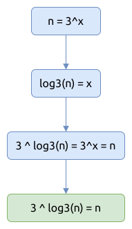
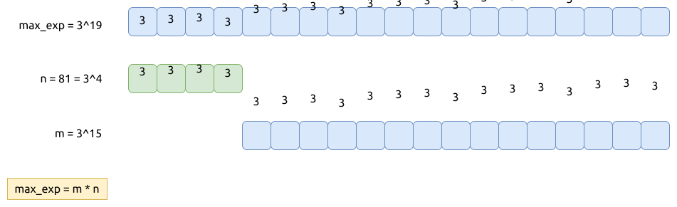

# 0326. 3的幂 Power of Three

[问题描述](https://leetcode.com/problems/power-of-three)

可以看一下下面列出的相关问题, 这三个问题有相同的解法, 也有不同的解法.

像暴力法 (brute force), 递归法以及迭代法, 都是相通的, 我们就不再重复介绍了. 但仍然列出它们的源代码在下面.

暴力法:

```rust
{{#include src/main.rs:5:26 }}
```

递归法:

```rust
{{#include src/main.rs:28:41 }}
```

将递归法改写为迭代的形式:

```rust
{{#include src/main.rs:43:57 }}
```

接下来, 介绍一下更快捷的方法:

## 指数-对数法

利用公式 `3 ^ log3(n) == n` 来计算, 先计算整数的对数, 再计算幂指数, 如果能得到相同的整数, 那就
说明计算对数时, 是被整除的, 没有小数部分被舍去. 这也就说明了 n 就是3的次幂.



这个方法也是通用的, 可以用来计算任意正整数的次幂.

```rust
{{#include src/main.rs:84:92 }}
```

## 质数的次幂的特性

这个解法也挺有趣的, 它利用了质数的次幂的特性:

- 假设, `max_exp` 是整数范围(`i32::MIN..=i32::MAX`) 内3的最大的次幂
- 如果 `n == 3^x`, 而 `max_exp = 3^max_x`, 则 `max_exp % n == 0`
- 如果 `max_exp = 3^max_x`, 而 `max_exp = m * n`, 则 m 和 n 都是3的次幂

也就是说, 我们只要找到整数范围(`i32::MIN -> i32::MAX`) 内3的最大的次幂, 我然后用它除以目标整数,
如果余数为0, 则3的最大次幂是这个目标整数的积; 否则, 该目标整数便不是3的次幂.

如果不好理解的话, 可以看下图:


要晓得的是, 这个方法只对质数的次幂有效.

关于如何计算最大次幂, 代码里的辅助函数有说明, 要注意的一点是整数相乘的溢出问题, 我们是利用了 `i32::overflowing_mul()`
方法来处理的.

```rust
{{#include src/main.rs:59:82 }}
```

## 相关问题

- [0231. 2的幂 Power of Two](../0231.power-of-two/index.md)
- [0342. 4的幂 Power of Four](../0342.power-of-four/index.md)
