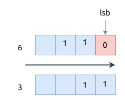

# 0338. 比特位计数 Counting Bits

[问题描述](https://leetcode.com/problems/counting-bits)

## 方法1, Brute Force

很容易就有了这个想法. 遍历 `0..=n` 的整数, 然后依次计算每个整数中比特位为`1`的个数.
Rust 提供了 `i32::count_ones()` 这样的方法, 它内部是调用的本平台的汇编指令, 还是很快的.

时间复杂度是 `O(n)`.

```rust
{{#include src/main.rs:5:9 }}
```

## 方法2, 使用动态规划

这个方法利用了一个重要的特性: `f(n) = f(n/2) + lsb`

解释一下就是, 整数 `n` 右移一位, 丢弃掉它的最低有效位 (least significant bit, lsb) 后, 就是 `n/2`

可以看下面的图:



时间复杂度是 `O(n)`.

```rust
{{#include src/main.rs:11:23 }}
```