# 0349. 两个数组的交集 Intersection of Two Arrays

[问题描述](https://leetcode.com/problems/intersection-of-two-arrays)

这是一个搜索问题, 这个问题的解法就比较多了.

## 并行双指针 Parallel Two Pointers

这个也比较符合[并行双指针](../../two-pointers/parallel.md)的使用场景, 遍历两个数组或链表,
用它能很快地计算集合的交集和并集.


在使用双指针之前, 要先对数组进行排序, 让重复的元素挨在一起.

这种方法也合适输出结果包含重复元素的问题, 只要不去重即可.

```rust
{{#include src/main.rs:8:45 }}
```

## HashSet 的集合操作

Rust 语言的 `HashSet` 实现了集合操作, 我们可以先把数组成转 `HashSet`, 再利用它的 `HashSet::intersection()` 方法,
求出交集, 最后再把交集转换回数组即可.

整个方法代码量很少, 很简洁, 但性能不是最好的.

这种方法只合适输出结果不包含重复元素的问题, 如果要包含重复元素的话, 可以将 `HashSet` 换成 `HashMap`.

```rust
{{#include src/main.rs:47:52 }}
```

## 使用 Bitset

当一个数组是无序的, 而且里面也有重复元素时, 我们可以把它转换 `BitSet`, 而我们并不关心重复元素时, 可以实现对数组元素的快速查找.

C++ 这样的语言在标准库里自带了 BitSet, 但在 Rust 标准库里却没有, 还好它的实现不算复杂.

我们使用 `Vec<bool>` 来简化 BitSet 的实现, 性能会差一些.

```rust
{{#include src/main.rs:54:127 }}
```

实现 BitSet 类之后, 就可以用它来存储 `nums1` 了. 要注意的点有两个:

- 交集, 元素要在 `nums1` 和 `nums2` 中都存在
- 输出的结果不允许有重复的元素



这种方法只适合输出结果中不包含重复元素的问题.

```rust
{{#include src/main.rs:145:162 }}
```

## 二分查找法 Binary Search

上面提到了交集的两个特点:

- 交集, 元素要在 `nums1` 和 `nums2` 中都存在
- 输出的结果不允许有重复的元素

除了使用 HashSet 和 BitSet 之外, 我们也可以在原地给数组排序并去除重复元素.
然后遍历 `nums1`, 并用二分查找法检查这个元素在 `nums2` 中是否同样存在.

这种方法只适合输出结果中不包含重复元素的问题.

```rust
{{#include src/main.rs:164:185 }}
```

## 相关问题

- [0350. 两个数组的交集 II Intersection of Two Arrays II](../0350.intersection-of-two-arrays-ii/index.md)
