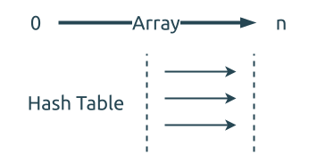

# 0350. 两个数组的交集 II Intersection of Two Arrays II

[问题描述](https://leetcode.com/problems/intersection-of-two-arrays-ii)

这类问题在 [0349. 两个数组的交集 Intersection of Two Arrays](../0349.intersection-of-two-arrays/index.md) 中
有好几个解法.

但是如果允许存在重复元素的话, 那可用的算法就少一些了.

## 并行双指针

这个方法依然有效, 只需要不跳过重复元素即可.


关于并行双指针的详细说明可以看[这里](../../two-pointers/parallel.md).

```rust
{{#include src/main.rs:8:39 }}
```

## 使用哈稀表来计数

在 [0349. 两个数组的交集 Intersection of Two Arrays](../0349.intersection-of-two-arrays/index.md) 有提到过,
`HashSet` 可以用来处理不包含重复元素的集合, 而 `HashMap` 可以用来处理包含有重复元素的集合.



```rust
{{#include src/main.rs:41:70 }}
```

## 相关问题

- [0349. 两个数组的交集 Intersection of Two Arrays](../0349.intersection-of-two-arrays/index.md)
