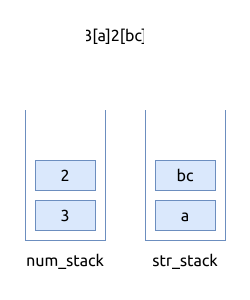

# 0394. 字符串解码 Decode String

[问题描述](https://leetcode.com/problems/decode-string)

这个问题也需要用栈, 因为有先入后入的操作.
但不同之处在于要使用两个栈, 分别存储数字和字符串.

另外, 在遍历字符串时, 要分别拼装数字和字符串.

以 `3[a]2[bc]` 为例:



## 代码实现

### Rust

```rust
{{#include src/main.rs:5:62}}
```

### C++

```cpp
{{#include main.cpp:5:54}}
```