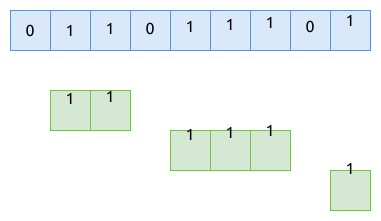

# 0485. 最大连续1的个数 Max Consecutive Ones

[问题描述](https://leetcode.com/problems/max-consecutive-ones)

## 滑动窗口

这是一个简单的滑动窗口的问题.

遍历数组, 计算出每个窗口的大小, 然后找出最大值即可.



要注意的点是:

- 遍历完数组后, 要检查最后一个窗口是不是最大值

```rust
{{#include src/main.rs:5:18 }}
```