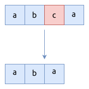

# 0680. 验证回文串 II Valid Palindrome II

[问题描述](https://leetcode.com/problems/valid-palindrome-ii)

在Rust中处理字符串, 远不如处理 `Vec<u8>` 或者 slice 简单, 所以这里我们在有必要时, 先把字符串
转换成数组: `let bytes = s.as_bytes();`

## 暴力法

利用题目中的要求, 按序依次跳过数组中的一个元素, 并判断它组成的新数组是不是回文.



```rust
{{#include src/main.rs:30:65 }}
```

这里的中间步骤, 每次都要构造一个新的数组. 而且新数组的大小与原来的数组基本是一样的.
对于有很多元素的数组来说, 遍历数组时, 每次的计算量并没有变化. 新数组的大小并没有快速收敛.

比如, 计算 `s = "abcadecba"`, 可以看到每次循环它的计算量是不变的.

```text
abcadecba
abcadecba
abcadecba
abcadecba
abcadecba
abcadecba
abcadecba
abcadecba
abcadecba
```

## 使用一个靠拢型双指针

这个是对暴力法的优化, 它完全不需要分配堆内存, 但思路是没有变的:
按序依次跳过数组中的一个元素, 并判断它组成的新数组是不是回文.

```rust
{{#include src/main.rs:67:105 }}
```

这个优化基本无效的, 因为上面提到的核心问题没解决.

## 使用两个靠拢型双指针

这个是对上面方法的优化, 在外层遍历数组时, 也换成双指针法, 用于快速减少子数组中的元素个数. 这样可以
快速收敛, 这对于有大量元素的数组来说很有效.

```rust
{{#include src/main.rs:107:134 }}
```

计算 `s = "abcadecba"`, 可以看到, 其过程在快速收敛:

```text
abcadecb
bcadec
cade
ad
```

## 相关问题

- [0125. 验证回文串 Valid Palindrome](../0125.valid-palindrome/index.md)
