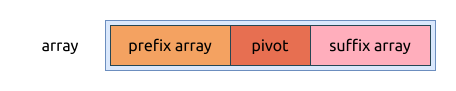

# [寻找数组的中心下标 Find Pivot Index]()

[问题描述](https://leetcode.com/problems/find-pivot-index)

这个问题的本质是要理解 pivot index 的数学含义:



其关系如上图所示, 从中我们可以发现 `pivot index` 存在时要满足这些条件:

- pivot 元素将数组分成左右两部分, 分别叫 `prefix array` 和 `suffix array`
- `sum(prefix array) = sum(suffix array)`

然而, 还有一个隐藏的条件是:

`sum(prefix array) + pivot + sum(suffix array) = sum(array)`

## Brute force

上面的公式还可以转换成:

`sum(prefix array) + pivot + sum(prefix array) = sum(array)`

从左到右遍历数组中的所有元素, 循环终止的条件就是找到:

`sum(prefix array) + pivot + sum(prefix array) = sum(array)`

以下是代码实现:

```rust
{{#include src/main.rs:5:21}}
```

这种算法的特点是:

- 时间复杂度是 `O(n)`
- 空间复杂度是 `O(1)`

## 前缀和 Prefix Sum

直接计算 prefix sum 和 suffix sum.

这个方法跟上面的类似, 但是更好理解一些, 它不需要最开始说的公式转换:

- 首先计算所有元素的和, 作为 suffix sum; 同时将 prefix sum 初始化为 0
- 然后从左到右遍历数组, 将该本元从 suffix sum 中减去
    - 如果此时 `prefix sum == suffix sum`, 则当前元素就是 `pivot`, 当前位置就是 `pivot index`, 直接返回
    - 否则将该元素加到 prefix sum 中

算法实现如下所示:

```rust
{{#include src/main.rs:23:40}}
```

这种算法的特点是:

- 时间复杂度是 `O(n)`
- 空间复杂度是 `O(1)`