# 0852. 山脉数组的峰顶索引 Peak Index in a Mountain Array

[问题描述](https://leetcode.com/problems/peak-index-in-a-mountain-array)

这个问题比 [0162](../0162.find-peak-element/index.md) 的条件简单一些,
它只有一个峰值存在, 但解法也差不多.

## 暴力法

遍历整个数组, 找到唯一的那个峰值, 也就是最大值.

```rust
{{#include src/main.rs:5:15}}
```

时间复杂度是 `O(n)`.

## 二分查找法

使用二分查找法找出峰值, 它与 middle 的元素有三种关系:

- `middle` 处就是峰值
- 峰值位于 `middle` 的左侧
- 峰值位于 `middle` 的右侧



但我们对它进行了一下简化, 步骤是:

1. 创建两个指针, 其中 left 指向数组的最左侧, right 指向数组最右侧
2. 开始二分查找法的循环, 计算中间节点 middle, 并确定 middle 与峰值的关系:
    1. 如果 `arr[middle] < arr[middle + 1]`, 说明峰值位于 middle 的右侧, 此时向右移动 left 指针, 令`left = middle + 1`
    2. 否则说明峰值位于 middle 处或者在其左侧, 此时向左移右 right 指针, 令 `right = middle`
3. 当 `left == right` 时, 找到了峰值, 终断循环并返回

算法的实现如下:

```rust
{{#include src/main.rs:42:61}}
```

时间复杂度是 `O(log(n))`.