# 1518. 换水问题 Water Bottles

[问题描述](https://leetcode.com/problems/water-bottles)

所谓的兑换空瓶子, 问题就是 **商与余数(DivMod)** 的问题.

想到这个方向, 就简单了. 但要考虑到几个细节问题:

- `num_bottles` 就是被除数
- `num_exchange` 就是除数
- 一次兑换交易, 从空瓶子换成满瓶水, 就是一个整数的除法操作
- 既然是整数除法, 那就有可能还有余数



代码里有更详细的注释:

```rust
{{#include src/main.rs:5:25 }}
```