# 1780. 判断一个数字是否可以表示成三的幂的和 Check if Number is a Sum of Powers of Three

[问题描述](https://leetcode.com/problems/check-if-number-is-a-sum-of-powers-of-three)

这个题目比较费脑子, 要反复仔细考虑题目里的细节, 这算是个数学问题.

这个题目可以用下面的数学公式表述出来:

\\[ n = a_i \sum_{i=0} 3^{x_i}, a_i \in \\{ 0, 1 \\} \\]

解释一下这个公式:

- 该整数n, 是有三的多个次幂之和组成
- 三的某次幂, 比如 `3^5`, 只可能在这个求和公式中出现0次或者1次

然后, 我们可以反向思考, 如果我们能依次算出 `a_i` 的值, 并对比它的值是不是0或者1, 就可以最终解决问题了.

如果还不好理解, 就看一下下图:


基于以上的解释, 就可以写代码了:

```rust
{{#include src/main.rs:5:16 }}
```

## 相关问题

- [0326. 3的幂 Power of Three](../0326.power-of-three/index.md)
