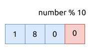

# 2119. 反转两次的数字 A Number After a Double Reversal

[问题描述](https://leetcode.com/problems/a-number-after-a-double-reversal)

仔细分析这个问题, 可以发现一个细节: 只要在反转时不丢弃任何一个数字, 才能保证两次反转后的整数值不变.

那么什么情况下会丢弃数字呢? 只有个位数为0的整数, 在反转一次时, 会将作为前缀的0给丢弃掉.
其它类型的整数, 在反转两次后, 一定保持不变的.

当然了, 整数本身为0, 是一个特属情况.

取得整数个位数字的方法也很简单, 只需要做一次 `%10`, 将十进制的整数右移一位即可.



最终的代码如下:

```rust
{{#include src/main.rs:5:10 }}
```